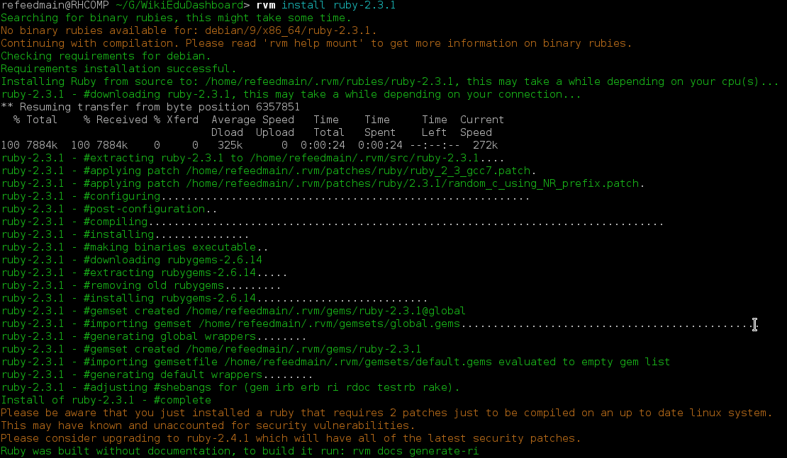
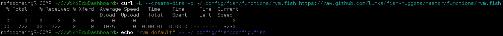
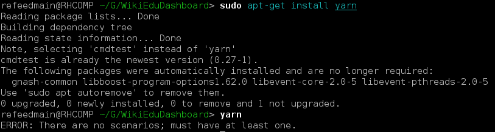
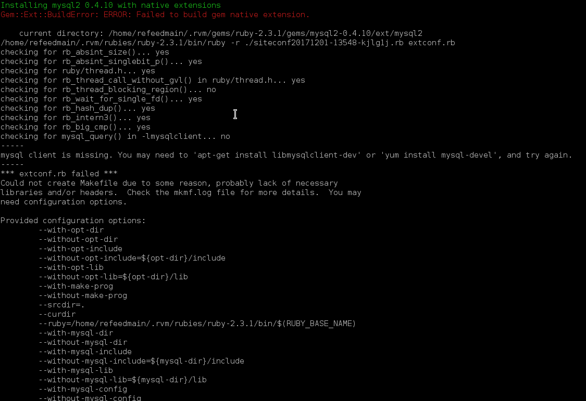
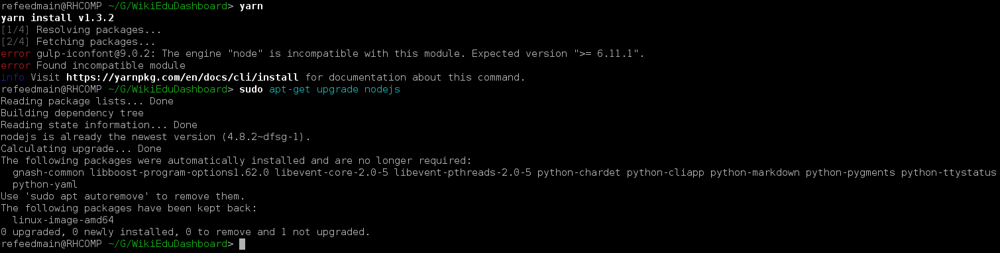
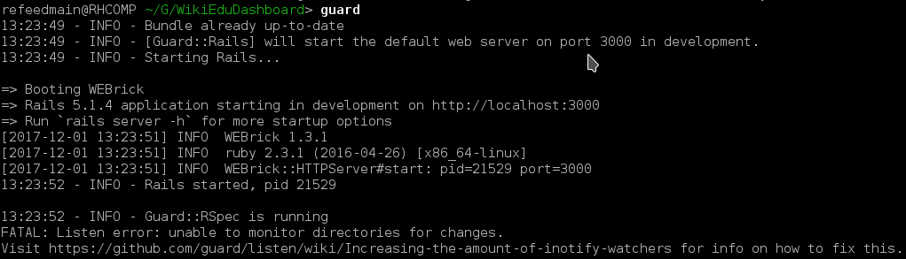

# WikiEduDashboard-setup-debian9-fish

Hello everyone!

This repo is intended to document my problems when installing
WikiEduDashboard
on Debian 9 with fish shell.

The test result when executing `gulp build ; rspec ; yarn test` is available on [test-result.txt](test-result.txt).

Dashboard image:

Problems that I had from installing WikiEduDashboard in Debian 9 with `fish` shell:

- `rvm` is not installed in Debian 9 by default. I overcome this by installing `rvm` by following instructions in https://rvm.io/rvm/install.

- When installing `rvm` I need to follow the instruction for fish integration on https://rvm.io/integration/fish.

- When installing `yarn` with `apt-get install yarn`, it turned out `apt-get` installed the wrong `yarn` (that comes from `cmdtest` package).
To overcome this I had to add the `yarn`'s repo to the `sources.list.d`, the instructions to do this available at https://yarnpkg.com/lang/en/docs/install/ .

- Failed to execute `bundle install`, since there's an error when installing `mysql2 0.4.10 with native extensions`, I had to overcome
it by installing `default-libmysqlclient-dev` package.

- Failed when executing `yarn` command, since `nodejs` is not in the requested version, and when I tried to install the latest
version, `apt-get` just says that `nodejs` is already in the latest version. I overcomed this by installing node from `nodesource`.
The instructions are available in https://github.com/nodesource/distributions#installation-instructions .

- `guard` failed to start because of `FATAL: Listen error: unable to monitor directories for changes.`. As the error message suggests, 
I overcomed this problem by adding more `watchers` (https://github.com/guard/listen/wiki/Increasing-the-amount-of-inotify-watchers).

